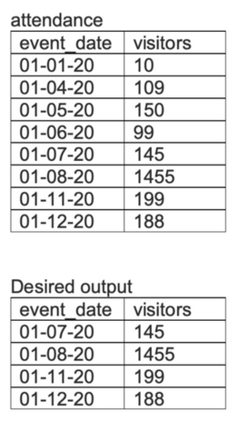

## Problem

The attendance table logs the number of people counted in a crowd each day an event is held. Write a query to return a table showing the date and visitor count of high-attendance periods, defined as three consecutive entries (not necessarily consecutive dates) with more than 100 visitors.

