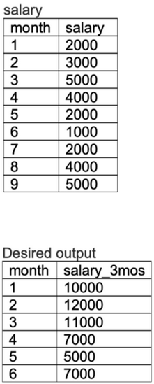

## Problem

The following table shows the monthly salary for an employee for the first nine months in a given year. From this, write a query to return a table that displays, for each month in the first half of the year, the rolling sum of the employee’s salary for that month and the following two months, ordered chronologically.

