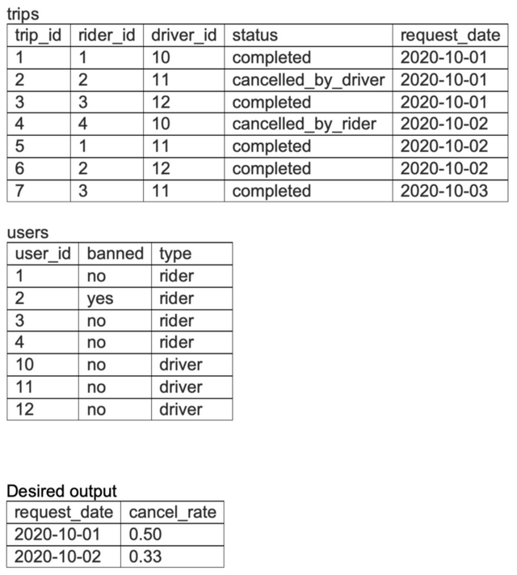

## Problem

From the given trips and users tables for a taxi service, write a query to return the cancellation rate in the first two days in October, rounded to two decimal places, for trips not involving banned riders or drivers. 

