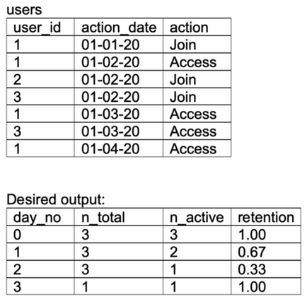

## Problem

From the following user activity table, write a query to return the fraction of users who are retained (show some activity) a given number of days after joining. By convention, users are considered active on their join day (day 0).

