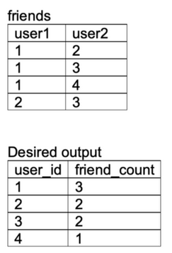

## Problem

Given the following table, return a list of users and their corresponding friend count. Order the result by descending friend count, and in the case of a tie, by ascending user ID. Assume that only unique friendships are displayed
(i.e., [1, 2] will not show up again as [2, 1] )

